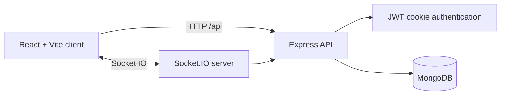

# PulseChat

PulseChat is a full-stack, real-time, one-to-one messaging application. It pairs a React/Vite client with an Express and Socket.IO API, MongoDB persistence, and cookie-based authentication.

## Highlights

- Account registration, login, and logout with signed JWT cookies
- Real-time private messages and online presence
- Conversation history persisted in MongoDB
- Responsive React interface with client-side route protection
- Lint and production-build checks in GitHub Actions

## Architecture



## Project layout

```text
client/                 React application and Vite configuration
  src/features/         Chat and conversation UI grouped by feature
  src/contexts/         Authentication and socket providers
  src/store/            Shared Zustand conversation state
server/                 Express and Socket.IO application
  src/config/           Environment loading and database connection
  src/controllers/      Request handlers
  src/models/           Mongoose models
  src/realtime/         Socket.IO setup and presence tracking
.github/workflows/      CI and CodeQL workflows targeting master
```

## Prerequisites

- Node.js 20 or later (CI uses Node 24)
- A MongoDB database or MongoDB Atlas connection string

## Setup

1. Create your local configuration from the included template:

   ```bash
   cp .env.example .env
   ```

   On PowerShell:

   ```powershell
   Copy-Item .env.example .env
   ```

2. In `.env`, set non-empty values for `MONGODB_URI` and `JWT_SECRET`. `CLIENT_ORIGIN` defaults to `http://localhost:3000`.

3. Install each application independently:

   ```bash
   npm ci --prefix server
   npm ci --prefix client
   ```

4. Run the server and client in separate terminals:

   ```bash
   npm run dev:server
   npm run dev:client
   ```

5. Visit `http://localhost:3000`.

## Available commands

| Command | Purpose |
| --- | --- |
| `npm run dev:server` | Start the API and Socket.IO server with reloads. |
| `npm run dev:client` | Start the Vite development server. |
| `npm run build` | Create the client production build. |
| `npm run lint` | Run ESLint for the client. |
| `npm run start` | Serve the API and built client. |

## Environment reference

| Variable | Required | Description |
| --- | --- | --- |
| `MONGODB_URI` | Yes | MongoDB connection string. |
| `JWT_SECRET` | Yes | Long, unique secret used to sign authentication tokens. |
| `PORT` | No | Server port; defaults to `5000`. |
| `CLIENT_ORIGIN` | No | Allowed browser origin for Socket.IO; defaults to `http://localhost:3000`. |
| `VITE_SOCKET_URL` | No | Optional client Socket.IO URL when the API uses a different origin. |

Never commit populated `.env` files. Use `.env.example` as the safe, versioned configuration contract.


